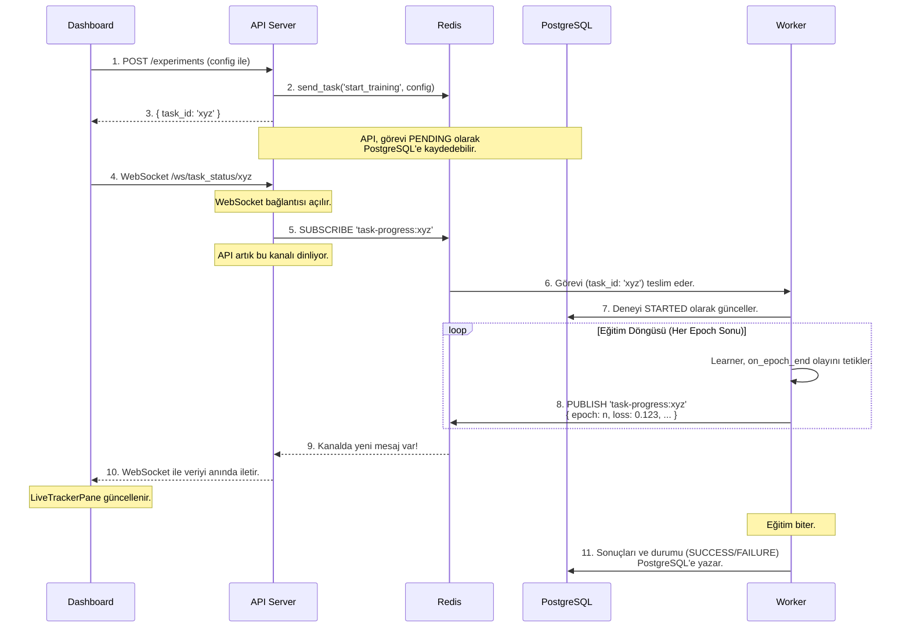

# 🏗️ AzuraForge Mimarisi

Bu belge, AzuraForge platformunu oluşturan servislerin ve bileşenlerin birbirleriyle nasıl etkileşime girdiğini, özellikle de **asenkron ve olay güdümlü yapının** nasıl çalıştığını detaylandırmaktadır. Bu yapı, platformun "The AzuraForge Way" felsefesinin teknik yansımasıdır.

## 1. Temel Bileşenler ve Sorumlulukları

Platform, her biri belirli bir göreve odaklanmış, Docker üzerinde çalışan bağımsız servislerden oluşur:

*   **`dashboard` (Arayüz Katmanı):** Kullanıcının etkileşime girdiği React tabanlı web uygulaması. Deneyleri başlatır, canlı ilerlemeyi gösterir, raporları görüntüler. Sadece `api` servisi ile konuşur.

*   **`api` (İletişim ve Ağ Geçidi Katmanı):** Platformun dış dünyaya açılan kapısıdır. Gelen istekleri doğrular ve görevleri `Celery` kuyruğuna (Redis) iletir. `Dashboard`'dan gelen canlı takip istekleri için `WebSocket` bağlantılarını yönetir ve Redis Pub/Sub kanallarına **abone (subscribe)** olarak `worker`'dan gelen olayları dinler.

*   **`worker` (İşleme Katmanı):** Ağır hesaplama yükünü üstlenir (model eğitimi, rapor oluşturma vb.). `Celery` kuyruğundan görevleri alır ve işler. Eğitim sırasında ilerleme bilgilerini (`loss`, `epoch` vb.) Redis Pub/Sub kanallarına **yayınlar (publish)**. `learner` ve `core` kütüphanelerini kullanarak AI modellerini çalıştırır.

*   **`redis` (Mesajlaşma ve Önbellek Katmanı):** Platformun merkezi sinir sistemidir. Hem `Celery` için görev kuyruğu (Broker) hem de canlı takip için bir Pub/Sub sunucusu olarak hizmet eder.

*   **`postgres` (Veri Kalıcılığı Katmanı):** Tüm deneylerin meta verilerini, konfigürasyonlarını ve sonuç özetlerini saklayan ilişkisel veritabanıdır.

## 2. Bir Deneyin Yaşam Döngüsü: Olay Güdümlü Akış

Aşağıdaki şema, kullanıcı bir deneyi başlattığı andan itibaren sistemde gerçekleşen olaylar zincirini göstermektedir.

### Akışın Adım Adım Açıklaması:

1.  **Deney Başlatma:** `Dashboard`, `API`'ye deney konfigürasyonunu içeren bir HTTP POST isteği gönderir.
2.  **Görev Kuyruğa Atma:** `API`, bu isteği alır ve `Celery`'nin `send_task` metoduyla görevi Redis'teki kuyruğa bırakır.
3.  **Anında Geri Dönüş:** `API`, görevin işlenmesini beklemeden, `Dashboard`'a anında bir `task_id` döndürür. Arayüz "donmaz".
4.  **Canlı Takip Bağlantısı:** `Dashboard`, aldığı `task_id` ile `API`'nin WebSocket endpoint'ine bağlanır.
5.  **Kanala Abone Olma:** `API`, bu `task_id`'ye özel bir Redis Pub/Sub kanalına (`task-progress:xyz`) abone olur ve sessizce beklemeye başlar.
6.  **Görevi Alma:** `Worker`, Redis kuyruğundaki görevi alır.
7.  **Durum Güncelleme:** `Worker`, göreve başladığını belirtmek için `PostgreSQL`'deki ilgili deney kaydının durumunu "STARTED" olarak günceller.
8.  **İlerleme Yayınlama:** Eğitim sırasında, `Learner`'daki `RedisProgressCallback`, her epoch sonunda ilerleme verisini (kayıp, epoch, canlı tahmin grafiği verisi vb.) ilgili Redis kanalına yayınlar.
9.  **Mesajı Yakalama:** `API`, abone olduğu kanalda bir mesaj belirdiğini anında fark eder.
10. **Anında İletim:** `API`, bu mesajı alır ve olduğu gibi WebSocket üzerinden `Dashboard`'a iletir. `Dashboard`'daki ilgili bileşen (grafik, ilerleme çubuğu) kendini günceller.
11. **Görevin Tamamlanması:** Eğitim bittiğinde, `Worker` nihai sonuçları ve görevin nihai durumunu (`SUCCESS` veya `FAILURE`) `PostgreSQL`'e yazar.

Bu mimari, hesaplama (`worker`) ve iletişim (`api`) katmanlarını birbirinden tamamen ayırarak platforma **sağlamlık, ölçeklenebilirlik ve gerçek zamanlılık** kazandırır.
