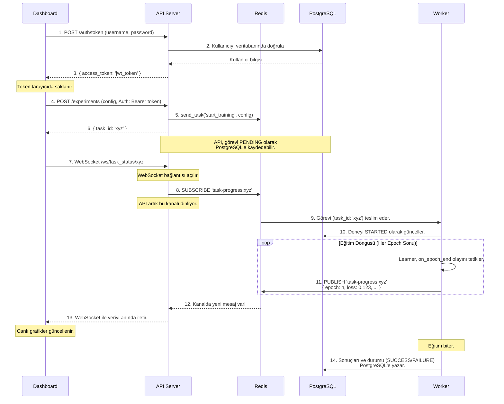

# 🏗️ AzuraForge Mimarisi

Bu belge, AzuraForge platformunu oluşturan servislerin ve bileşenlerin birbirleriyle nasıl etkileşime girdiğini, özellikle de **asenkron ve olay güdümlü yapının** nasıl çalıştığını detaylandırmaktadır. Bu yapı, platformun "The AzuraForge Way" felsefesinin teknik yansımasıdır.

## 1. Temel Bileşenler ve Sorumlulukları

Platform, her biri belirli bir göreve odaklanmış, Docker üzerinde çalışan bağımsız servislerden oluşur:

*   **`dashboard` (Arayüz Katmanı):** Kullanıcının etkileşime girdiği React tabanlı web uygulaması. Deneyleri başlatır, canlı ilerlemeyi gösterir, raporları görüntüler. Sadece `api` servisi ile konuşur.

*   **`api` (İletişim ve Ağ Geçidi Katmanı):** Platformun dış dünyaya açılan kapısıdır. **JWT tabanlı kimlik doğrulama** yapar. Gelen istekleri doğrular ve görevleri `Celery` kuyruğuna (Redis) iletir. `Dashboard`'dan gelen canlı takip istekleri için `WebSocket` bağlantılarını yönetir ve Redis Pub/Sub kanallarına **abone (subscribe)** olarak `worker`'dan gelen olayları dinler.

*   **`worker` (İşleme Katmanı):** Ağır hesaplama yükünü üstlenir (model eğitimi, rapor oluşturma vb.). `Celery` kuyruğundan görevleri alır ve işler. Eğitim sırasında ilerleme bilgilerini (`loss`, `epoch` vb.) Redis Pub/Sub kanallarına **yayınlar (publish)**. `learner` ve `core` kütüphanelerini kullanarak AI modellerini çalıştırır.

*   **`redis` (Mesajlaşma ve Önbellek Katmanı):** Platformun merkezi sinir sistemidir. Hem `Celery` için görev kuyruğu (Broker) hem de canlı takip için bir Pub/Sub sunucusu olarak hizmet eder.

*   **`postgres` (Veri Kalıcılığı Katmanı):** Tüm deneylerin meta verilerini, konfigürasyonlarını, sonuç özetlerini ve **kullanıcı bilgilerini** saklayan ilişkisel veritabanıdır.

## 2. Bir Deneyin Yaşam Döngüsü: Olay Güdümlü Akış (Kimlik Doğrulama ile)

Aşağıdaki şema, kullanıcı bir deneyi başlattığı andan itibaren sistemde gerçekleşen olaylar zincirini göstermektedir.

### Akışın Adım Adım Açıklaması:

1.  **Giriş Yapma:** `Dashboard`, kullanıcı adı ve parola ile `API`'nin `/auth/token` endpoint'ine bir istek gönderir.
2.  **Kullanıcı Doğrulama:** `API`, `PostgreSQL` veritabanında kullanıcıyı ve parolasını doğrular.
3.  **Token Alma:** Doğrulama başarılı olursa, `API` bir JWT (`access_token`) oluşturur ve `Dashboard`'a gönderir. Bu token tarayıcıda saklanır.
4.  **Deney Başlatma:** `Dashboard`, deney konfigürasyonunu ve **Authorization** başlığında JWT'yi içeren bir HTTP POST isteğini korumalı `/experiments` endpoint'ine gönderir.
5.  **Görev Kuyruğa Atma:** `API`, JWT'yi doğrular ve geçerliyse görevi Redis'teki kuyruğa bırakır.
6.  **Anında Geri Dönüş:** `API`, görevin işlenmesini beklemeden, `Dashboard`'a anında bir `task_id` döndürür. Arayüz "donmaz".
7.  **Canlı Takip Bağlantısı:** `Dashboard`, aldığı `task_id` ile `API`'nin WebSocket endpoint'ine bağlanır.
8.  **Kanala Abone Olma:** `API`, bu `task_id`'ye özel bir Redis Pub/Sub kanalına (`task-progress:xyz`) abone olur.
9.  **Görevi Alma:** `Worker`, Redis kuyruğundaki görevi alır.
10. **Durum Güncelleme:** `Worker`, göreve başladığını belirtmek için `PostgreSQL`'deki ilgili deney kaydının durumunu "STARTED" olarak günceller.
11. **İlerleme Yayınlama:** Eğitim sırasında, `RedisProgressCallback` ilerleme verisini ilgili Redis kanalına yayınlar.
12. **Mesajı Yakalama:** `API`, abone olduğu kanaldaki mesajı anında fark eder.
13. **Anında İletim:** `API`, bu mesajı WebSocket üzerinden `Dashboard`'a iletir ve arayüzdeki canlı grafikler güncellenir.
14. **Görevin Tamamlanması:** Eğitim bittiğinde, `Worker` nihai sonuçları ve görevin durumunu `PostgreSQL`'e yazar.

Bu mimari, hesaplama ve iletişim katmanlarını birbirinden ayırarak platforma **sağlamlık, ölçeklenebilirlik ve gerçek zamanlılık** kazandırır.
