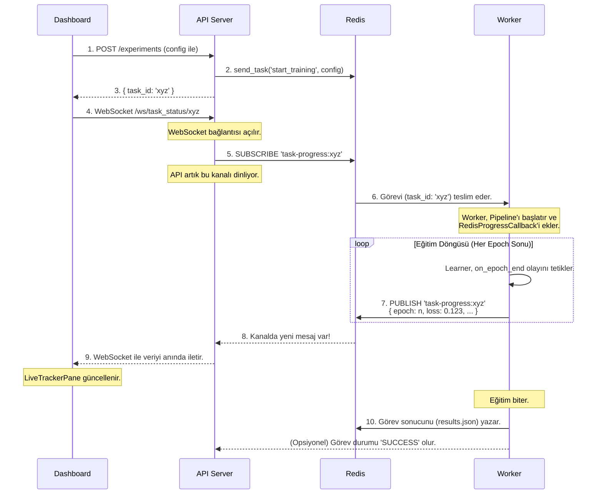

# 🏗️ AzuraForge Mimarisi

Bu belge, AzuraForge platformunu oluşturan servislerin ve bileşenlerin birbirleriyle nasıl etkileşime girdiğini, özellikle de **asenkron ve olay güdümlü yapının** nasıl çalıştığını detaylandırmaktadır.

## 1. Temel Bileşenler ve Sorumlulukları

Platform, her biri belirli bir göreve odaklanmış bağımsız servislerden oluşur:

*   **Dashboard (Arayüz Katmanı):**
    *   Kullanıcının etkileşime girdiği React tabanlı web uygulaması.
    *   Deneyleri başlatır, canlı ilerlemeyi gösterir, raporları görüntüler.
    *   Sadece `API` servisi ile konuşur.

*   **API (İletişim ve Ağ Geçidi Katmanı):**
    *   Platformun dış dünyaya açılan kapısıdır.
    *   Gelen istekleri doğrular ve görevleri `Celery` kuyruğuna (Redis) iletir.
    *   `Dashboard`'dan gelen canlı takip istekleri için `WebSocket` bağlantılarını yönetir.
    *   Redis Pub/Sub kanallarına **abone (subscribe)** olarak `Worker`'dan gelen olayları dinler.

*   **Worker (İşleme Katmanı):**
    *   Ağır hesaplama yükünü üstlenir (model eğitimi, rapor oluşturma vb.).
    *   `Celery` kuyruğundan görevleri alır ve işler.
    *   Eğitim sırasında ilerleme bilgilerini (`loss`, `epoch` vb.) Redis Pub/Sub kanallarına **yayınlar (publish)**.
    *   `Learner` ve `Core` kütüphanelerini kullanarak AI modellerini çalıştırır.

*   **Redis (Mesajlaşma ve Önbellek Katmanı):**
    *   Platformun merkezi sinir sistemidir.
    *   **Celery Broker & Backend:** `API` ve `Worker` arasındaki görev kuyruğu ve sonuç deposu olarak hizmet eder.
    *   **Pub/Sub Sunucusu:** `Worker` ile `API` arasında gerçek zamanlı, bloklamayan iletişim için kullanılır.

## 2. Bir Deneyin Yaşam Döngüsü: Olay Güdümlü Akış

Aşağıdaki şema, kullanıcı bir deneyi başlattığı andan itibaren sistemde gerçekleşen olaylar zincirini göstermektedir.

### Akışın Adım Adım Açıklaması:

1.  **Deney Başlatma:** `Dashboard`, `API`'ye deney konfigürasyonunu içeren bir HTTP POST isteği gönderir.
2.  **Görev Kuyruğa Atma:** `API`, bu isteği alır ve `Celery`'nin `send_task` metoduyla görevi Redis'teki kuyruğa bırakır.
3.  **Anında Geri Dönüş:** `API`, görevin işlenmesini beklemeden, `Dashboard`'a anında bir `task_id` döndürür. Arayüz "donmaz".
4.  **Canlı Takip Bağlantısı:** `Dashboard`, aldığı `task_id` ile `API`'nin WebSocket endpoint'ine bağlanır.
5.  **Kanala Abone Olma:** `API`, bu `task_id`'ye özel bir Redis Pub/Sub kanalına (`task-progress:xyz`) abone olur ve sessizce beklemeye başlar.
6.  **Görevi Alma:** `Worker`, Redis kuyruğundaki görevi alır ve `start_training_pipeline` görevini çalıştırmaya başlar.
7.  **İlerleme Yayınlama:** Eğitim sırasında, `Learner`'daki `RedisProgressCallback`, her epoch sonunda ilerleme verisini (kayıp, epoch vb.) ilgili Redis kanalına yayınlar.
8.  **Mesajı Yakalama:** `API`, abone olduğu kanalda bir mesaj belirdiğini anında fark eder.
9.  **Anında İletim:** `API`, bu mesajı alır ve olduğu gibi WebSocket üzerinden `Dashboard`'a iletir. `Dashboard`'daki ilgili bileşen (grafik, ilerleme çubuğu) kendini günceller.
10. **Görevin Tamamlanması:** Eğitim bittiğinde, `Worker` nihai sonuçları (`results.json`) yazar ve Celery görevini `SUCCESS` olarak işaretler.

Bu mimari, hesaplama (`Worker`) ve iletişim (`API`) katmanlarını birbirinden tamamen ayırarak platforma **sağlamlık, ölçeklenebilirlik ve gerçek zamanlılık** kazandırır.

